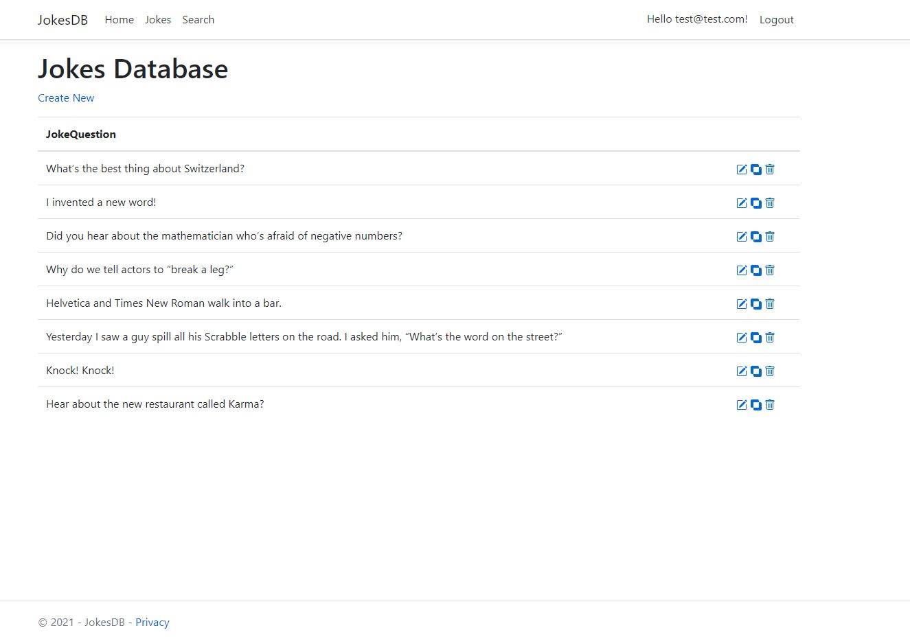

# Jokes Database

Jokes Database is created through the Object Relation Mapping.
[Wikipedia](https://en.wikipedia.org/wiki/Object%E2%80%93relational_mapping), [Stack Overflow](https://stackoverflow.com/questions/1279613/what-is-an-orm-how-does-it-work-and-how-should-i-use-one). The application has the basic CRUD operations and a search option. To make use of the CRUD operations the user need to be signed inn. The sign inn is **NOT** implemented with any form of validation.

